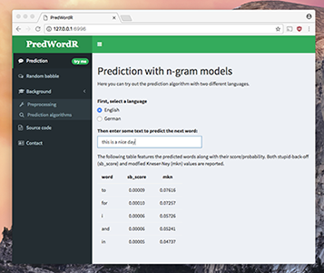

## Introduction
Predicting words is a task that can help a user when writing text on a mobile phone.
With small displays it can be cumbersome and lengthy to write texts.

This project aims to overcome this hurdley by providing a prediction algorithm that can foresee the word most likely to be typed next based on the previous text.

Two different approaches were implemented in a shiny app prototype to investigate the practicality of the algorithms.

{.img_left} One main advantage of the shiny app is the immediate feedback from the users.
This allows for an agile development process where different ideas can be tested out quickly.  
You can try out the app [here](https://jschelbert.shinyapps.io/PredWordR/).

## Development of the app
The first step in creating the shiny app was to preprocess the training data which consisted of several crawled texts from news websites, blogs and twitter messages.  
For this we stipped out unwanted characters, numbers, URLs, twitter handles and more.

In the app we provide two models that are based on the number of occurences of word sequences, called n-grams.
A main pre-computation step consisted of counting the occurences and generating the appropriate probabilities needed for predicting the next words.

A profanity filter function allows the user control over the suggestion of smear words.

As an additional fun feature we included a *random babble* mode where the app generates random texts by continuing some user input with predicted words.

## Used language models
We employed two models to evaluate likelihood of the next word.
The **stupid back-off** model which is very easy to implement delivers good results.

In addition, we implemented the more advanced **modified Kneser-Ney approach** that also takes the surroundings of a word into account for computing the likelihood.

Both approaches can be used to compute a score for each n-gram which can then later be used to make the suggestions for the next word.

To reduce the storage requirements of our model we omitted lots of n-grams that did not occur often in our training set.
The usage of the `data.table` package with it's binary index search enables super fast lookups of the suggestions: 
less than $5\,\text{ms}$ on a sixyears old desktop computer.

For the interested user the app includes some mathematical background explanation for the used models.

## Future extensions
For the future several extensions could be implemented to enhance the app:

* Add additional languages for predicting words.
* Use a neural net approach instead of the classical n-gram-based algorithms. <!-- first alpha test is given [here](http://www.schelberts.de/shinyapps/lstm_text_predict) (unfortunately does not work directly on shinyapps.io).-->
* Allow for character prediction for partially typed words. This could be very likely achieved via the neural net approach mentioned above.
* Auto-correct for mistyped words.
* Implement swiping techniques for mobile devices.
* **Your idea to make this app more awesome...**
